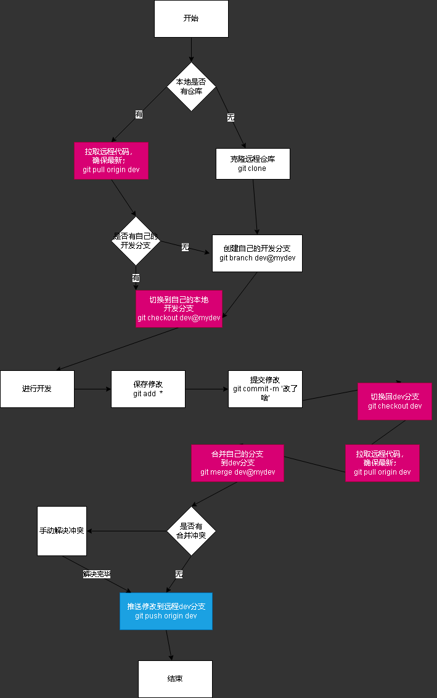

# primary-care-client

## 原型设计图
  访问密码发在群里

https://rp.mockplus.cn/view/by848unT9H/lIeaPGarX06?nav=1&cps=expand&rps=expand&rt=1&la=0&out=0&ha=0&dt=none&


## 功能划分

  在线问诊模块
  -  医生查询
  -  医生推荐
  -  医生列表（分类）
  -  咨询医生（先做单向聊天）
  -  问诊消息列表

  预约挂号模块
   - 医院查询
   - 医院信息列表
   - 科室选择
   - 医生选择 （先不考虑有无号/医生是否有空（默认有空））
  -  提交预约
  -  我的预约列表 （全部/待预约/已完成）

  医疗宝典模块
   - 按照疾病等分类查询疾病
   - 首页健康新闻
      - 新闻详情页
   - 首页社区活动

  药品查询模块
   - 搜索药品
   - 药品信息列表
   - 跳转百度百科药品详情页

  用药提醒模块
   - 提醒列表
   - 添加提醒
     -  提供药品名/用药时间/药单位/剂量等添加

  个人信息模块
    - 我的档案栏
     -  过往病史查看与添加
   -  个人健康数据栏
      -  更新健康数据
   -  地址管理（暂无）
    - 退出账号
   -  关于
    
  登录注册模块
    - 登录
      - 初次登录手机号+密码 后序使用jwt保存登录凭证
   -  注册
     -  所有信息为必填项 只需正则验证
    
  社区药房模块（暂无）

## 运行
  ```sh
  npm i # 首次拉项目时安装依赖
  npm run serve # 运行项目预览
  ```
## 文件结构说明

 ### 公共组件/工具类/样式


## 协作开发说明
 合并推送使用master分支, 开发使用自己的本地dev（叫什么名字随便）分支（该分支不提交远程，只用于合并到mastar分支，把mastar分支提交远程）


### 大致流程



 ### 创建自己的开发分支
```sh
git branch dev # 创建自己的分支
git checkout dev  # 切换到自己的分支
```
### 提交修改
```sh
git add *  # 提交所有修改
git commit -m '你的提交信息' # 提交到本地暂存区
```
### 将自己的开发分支合并到master分支
```sh
git checkout master # 切换到master分支
git merge dev # 将你的dev本地分支和master合并
```
### 提交开发分支
```sh
git push origin master # 提交master分支到远程仓库
```

### 其他日常命令
```sh
git status # 查看仓库状态（红色已修改未提交/绿色已提交）
git log # 查看当前分支历史提交日志
git branch # 查看所有分支
git branch mydev # 创建名为 `mydev` 的分支
git checkout master # 从当前分支切换到 master 分支
```
不熟悉命令的，vscode有相应的可视化操作

**温馨提示： git操作出现错误或冲突时从网上找的解决方案谨慎使用🤔**

## 规范说明(尽量)

  1. 命名尽量使用英文翻译
  2. js尽量写分号


